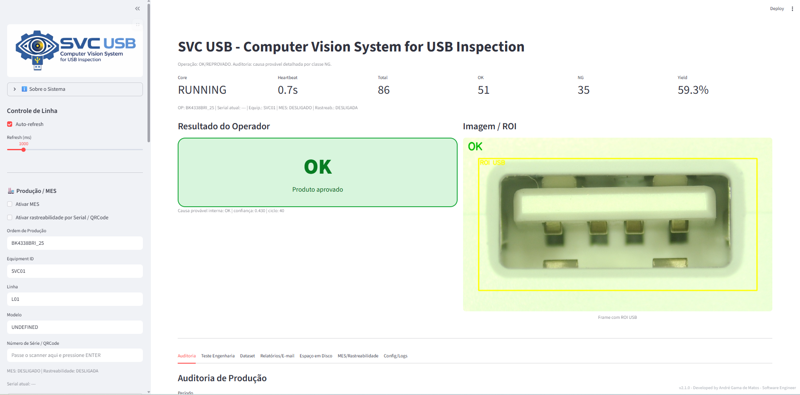
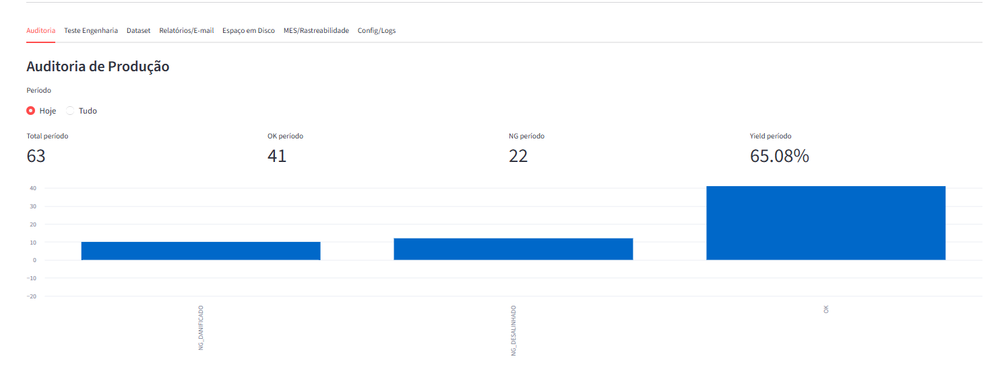
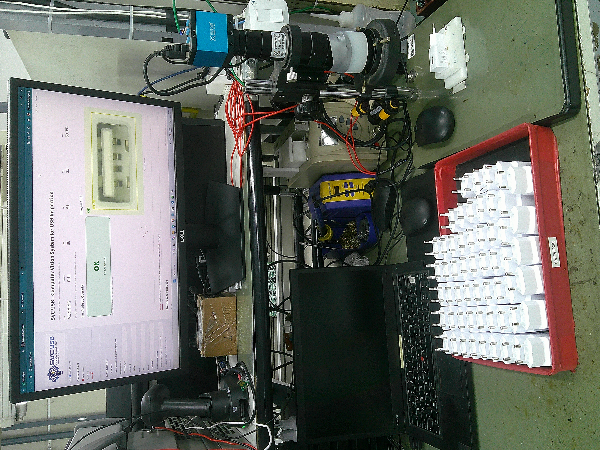
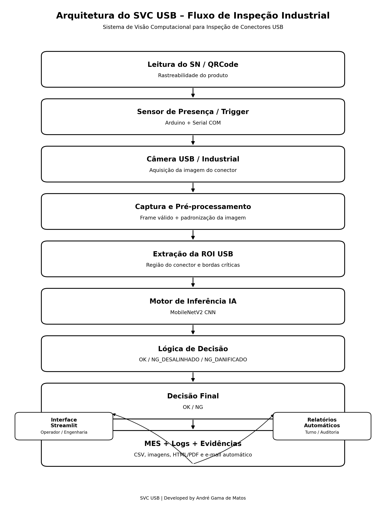

# SVC – Computer Vision System for USB Connector Inspection

<p align="center">
  
</p>

Industrial AI-based computer vision platform for automated detection of **USB connector assembly defects in mobile phone chargers**.

**Inspection Mode:** Single ROI USB Connector Inspection

[](https://doi.org/10.5281/zenodo.20332828)


---

# Overview

**SVC USB (Computer Vision System for USB Inspection)** is a low-cost industrial computer vision platform designed for **automated inspection of USB connectors installed in mobile phone chargers**.

The system uses **deep learning and industrial triggering mechanisms** to detect assembly defects during production.

The platform evolved from the **SVC Spring Inspection architecture**, adapting the same industrial AI framework for USB connector inspection.

---

# Key Features

✔ Low-cost industrial computer vision architecture  
✔ CNN-based inspection using **MobileNetV2**  
✔ Single ROI inspection strategy for USB connector region  
✔ CPU-only inference (no GPU required)  
✔ Automatic inspection triggering via proximity sensor  
✔ Industrial operator interface built with **Streamlit**

---

# System Architecture

Operational pipeline:

Sensor Trigger  
↓  
Image Acquisition (USB Industrial Camera)  
↓  
ROI Extraction (USB Connector Region)  
↓  
CNN Classification (MobileNetV2)  
↓  
Industrial Decision Logic  
↓  
Operator Interface + Production Logging  
↓  
Evidence Storage + Reporting

---

# Hardware Components

Industrial PC (Windows 10 / 11)  
Intel Core i3 12th Gen or higher  
8 GB RAM minimum  
Industrial USB camera  
Arduino Uno microcontroller  
E18-D80NK proximity sensor

---

# Software Stack

Python  
TensorFlow / Keras  
OpenCV  
Streamlit  
PySerial  
Pandas  
Matplotlib

---

# Artificial Intelligence Model

The inspection system uses **MobileNetV2 with Transfer Learning**.

### Model Classes

OK — USB connector correctly assembled  
NG_DANIFICADO — Damaged connector structure  
NG_DESALINHADO — Connector misaligned during assembly

The CNN analyzes the **USB connector region of interest (ROI)** and classifies the detected condition.

---

# Decision Logic

The system analyzes a **single ROI containing the USB connector**.

The CNN model predicts the connector condition. If a defect is detected, the product is automatically rejected.

This approach allows **fast inspection and reliable detection of assembly defects**.

---

# Dataset Collection System

The SVC USB includes a built-in **dataset generation tool** allowing engineers to capture inspection images directly from production.

Benefits:

• Continuous dataset expansion  
• Faster AI retraining cycles  
• Real industrial defect collection  
• Improved model robustness

Images are automatically organized into structured dataset folders.

---

# Evidence Management System

When a defect is detected, the system automatically stores an **NG evidence image**.

These images support:

• Quality audits  
• Failure investigations  
• Dataset expansion  
• Manufacturing process improvements

Retention options:

30 days  
60 days  
90 days

Older evidence images are automatically removed automatically according to retention policies.

---

# Automated Reporting

The SVC system can generate inspection reports containing:

• Production yield  
• Defect distribution  
• Inspection statistics  
• Traceability data

Reports can be exported for **industrial auditing and quality monitoring**.

---

# Installation

Create project directory:
C:\SVC_INSPECAO_USB

Create virtual environment:
python -m venv .venv_usb


Activate environment:
..venv_usb\Scripts\Activate.ps1


Install dependencies:
pip install -r requirements.txt


---

# Running the System

streamlit run app_camera_infer_usb.py

Or use the launcher:

INICIAR_SVC_USB.bat


---

# Research Context

This project contributes to research in:

• Industrial computer vision  
• Automated quality inspection  
• Deep learning for manufacturing  
• Smart Manufacturing / Industry 4.0
• Control and Automation Engineering


The system demonstrates the feasibility of **deploying deep learning inspection systems using low-cost hardware in real manufacturing environments**.

---


# Citation

If you use this system in research or industrial projects, please cite:

Matos, A. G. (2026)  
**SVC USB – Computer Vision System for USB Connector Inspection**  
Zenodo  
https://doi.org/10.5281/zenodo.20332828

---

## Author

**André Gama de Matos**  
Student — Control and Automation Engineering  

Undergraduate Final Project (TCC)  
Control and Automation Engineering  
Centro Universitário UNIFATECIE

**Advisor**  
Prof.  Lucas Delapria Dias dos Santos

---

# License

MIT License — Open source software for research and industrial experimentation.


# SVC USB
### Computer Vision System for USB Connector Inspection

<p align="center">
  
</p>

Industrial AI-based computer vision platform for automated detection of USB connector assembly defects in mobile phone chargers.

**Inspection Mode:** Single ROI USB Connector Inspection

[](https://doi.org/10.5281/zenodo.20332828)


---

# Overview

**SVC USB (Computer Vision System for USB Connector Inspection)** is a low-cost industrial computer vision platform designed for automated inspection of USB connectors installed in mobile phone chargers.

The system uses deep learning, industrial triggering mechanisms, and automated production traceability resources to detect assembly defects during manufacturing.

The platform evolved from the original SVC Industrial architecture for spring inspection, adapting the same AI-based industrial inspection framework for USB connector validation.

The system operates under real industrial conditions using CPU-only inference and low-cost hardware components.

---

# Key Features

✔ Low-cost industrial computer vision architecture  
✔ CNN-based inspection using MobileNetV2  
✔ Single ROI inspection strategy for USB connector region  
✔ CPU-only inference (no GPU required)  
✔ Automatic inspection triggering via industrial sensor  
✔ Industrial operator interface built with Streamlit  
✔ Automated industrial inspection workflow  
✔ Industrial production traceability support  

### Advanced Industrial Features

✔ Automatic HTML/PDF inspection reports  
✔ Automatic email delivery of inspection reports  
✔ Integrated industrial audit interface  
✔ Production statistics and yield monitoring  
✔ Evidence image saving for NG products  
✔ Engineering analysis mode  
✔ QRCode / Serial Number traceability  
✔ Persistent industrial configuration storage  
✔ Laboratory inspection mode via image upload  

---

# System Architecture

Operational pipeline:

Sensor Trigger  
→ Image Acquisition  
→ ROI Extraction (USB Connector Region)  
→ CNN Classification (MobileNetV2)  
→ Industrial Decision Logic  
→ Operator Interface + Production Logging  
→ Traceability + Reporting + Email Notification

The system supports automatic triggering using an Arduino Uno microcontroller connected through serial communication.

---

# Hardware Components

Industrial PC (Windows 10 / 11)  
Intel Core i3 12th Gen or higher  
8 GB RAM minimum  
Industrial USB camera  
Arduino Uno microcontroller  
E18-D80NK proximity sensor

---

# Software Stack

| Layer | Technology |
|---|---|
| AI Framework | TensorFlow / Keras |
| Computer Vision | OpenCV |
| Interface | Streamlit |
| Serial Communication | PySerial |
| Data Processing | Pandas |
| Visualization | Matplotlib |

---

# Artificial Intelligence Model

The inspection system uses MobileNetV2 with Transfer Learning.

### Model Classes

OK — USB connector correctly assembled  
NG_DANIFICADO — Damaged connector structure  
NG_DESALINHADO — Connector misaligned during assembly  

The CNN analyzes the USB connector ROI and predicts the detected assembly condition.

---

# Industrial Decision Logic

The system analyzes a single ROI containing the USB connector region.

If the CNN model detects a defect, the product is automatically rejected.

This strategy improves industrial robustness and reduces false approvals during manufacturing.

---

# Dataset Collection System

The SVC USB platform includes a built-in dataset generation tool allowing engineers to capture inspection images directly from production.

Benefits:

• Continuous dataset expansion  
• Faster AI retraining cycles  
• Real industrial defect collection  
• Improved model robustness  

Images are automatically organized into structured dataset folders.

---

# Evidence Management System

When a defect is detected, the system automatically stores an NG evidence image.

These images support:

• Quality audits  
• Failure investigations  
• Dataset expansion  
• Manufacturing process improvements  

Storage management features include:

• Disk usage monitoring  
• Automatic alerts  
• Configurable retention policies  

Retention options:

30 days  
60 days  
90 days  

Older evidence images are automatically removed according to retention policies.

---

# Traceability and MES Support

The system includes industrial traceability resources designed for production environments.

Features include:

• QRCode integration  
• Serial number registration  
• Production logging  
• Inspection history tracking  
• Equipment identification  
• Operator traceability support  

The architecture supports future MES integration workflows.

---

# Automated Reporting

The SVC USB system automatically generates industrial inspection reports.

Supported report types:

Immediate inspection reports  
Shift production reports  
Daily production reports  

Reports include:

• Production yield  
• Defect distribution  
• Inspection statistics  
• Traceability data  
• Equipment information  
• Production line information  

Reports can be exported for industrial auditing and quality monitoring.

---

# Industrial Validation

The system was validated using real USB connector samples collected directly from industrial production.

Validation included:

• OK products  
• Misaligned connectors  
• Damaged connectors  

The results demonstrated the feasibility of deploying low-cost deep learning systems for industrial USB inspection tasks.

---

# Technology Readiness

The SVC USB platform evolved from an academic prototype into a production-oriented industrial inspection system.

The project includes:

- real-time industrial inspection
- automated reporting
- AI-based defect classification
- industrial audit interface
- production traceability
- embedded triggering mechanisms

---

# System Images

## Industrial Operator Interface



## Validation Results



## Prototype System



## System Architecture



---

# Future Work

Planned future developments include:

- advanced MES integration
- industrial cloud synchronization
- automated SPC dashboards
- edge AI optimization
- advanced industrial analytics
- multi-camera synchronization
- automatic ROI self-calibration

---

# Installation

Create project directory:

```bash
mkdir C:\SVC_INSPECAO_USB
cd C:\SVC_INSPECAO_USB

Create virtual environment:

python -m venv .venv_usb

Activate environment:

.\.venv_usb\Scripts\Activate.ps1

Install dependencies:

pip install -r requirements.txt
Running the System

Start the industrial core:

INICIAR_CORE_USB_V2_1_PRODUCAO.bat

Start the operator interface:

INICIAR_APP_USB_V2_1_PRODUCAO.bat

Or use the unified launcher:

INICIAR_SVC_USB.bat
Research Context

This project contributes to research in:

• Industrial computer vision
• Automated quality inspection
• Deep learning for manufacturing
• Smart Manufacturing / Industry 4.0
• Control and Automation Engineering

The system demonstrates the feasibility of deploying deep learning inspection systems using low-cost hardware in real manufacturing environments.

Citation

If you use this system in research or industrial projects, please cite:

Matos, A. G. (2026)
SVC USB – Computer Vision System for USB Connector Inspection
Zenodo
https://doi.org/10.5281/zenodo.20332828

Author

André Gama de Matos
Student — Control and Automation Engineering

Undergraduate Final Project (TCC)
Control and Automation Engineering
Centro Universitário UNIFATECIE

Advisor
Prof. Lucas Delapria Dias dos Santos

License

MIT License — Open source software for research and industrial experimentation.
